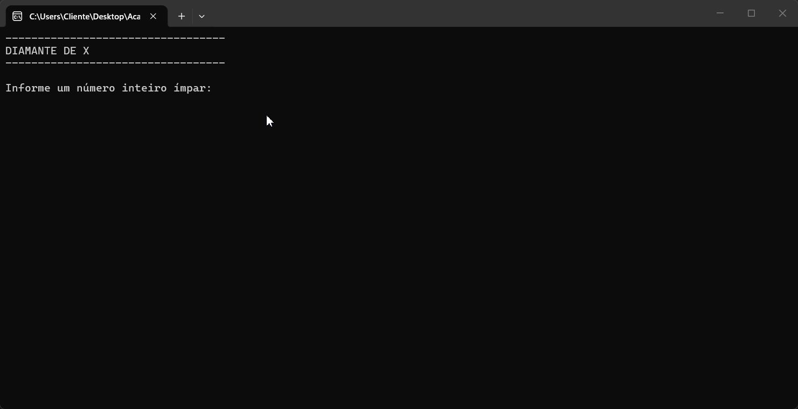

# 💎 DIAMANTE DE X💎



## 💎 INTRODUÇÃO

Este projeto foi desenvolvido em C# com execução via Console e tem como objetivo simular um sistema de gerenciamento e análise de diamantes em um ambiente lógico. A aplicação permite manipular dados relacionados a características como peso, valor, classificação e lapidação, oferecendo uma forma estruturada de processar informações sobre pedras preciosas.

Desenvolvido por Iago na Academia do Programador.

## FUNCIONALIDADES
* Cadastro de diamantes com atributos como peso (quilates), cor, pureza e valor.
* Sistema de classificação baseado em critérios gemológicos.
* Processamento de entradas do usuário via Console.
* Validação de dados (tipos numéricos e texto).
* Conversão automática de entradas para formatos adequados.
* Arquitetura modular com separação entre lógica e execução.
* Exibição detalhada das informações dos diamantes cadastrados.
* Suporte para múltiplas operações em sequência.

## Como utilizar o programa

1. Clone o repositório ou baixe o código comprimido em .zip.
2. Abra o emulador de terminal e navegue até a pasta raiz.
3. Utilize o comando abaixo para restaurar as dependências do projeto.

     ```
     dotnet restore
     ```

4. Em seguida compile e execute o projeto com o comando: 

    ```
    dotnet run --project DiamanteDeX.ConsoleApp
    ```

## Requistitos

* .NET SDK 10.0
